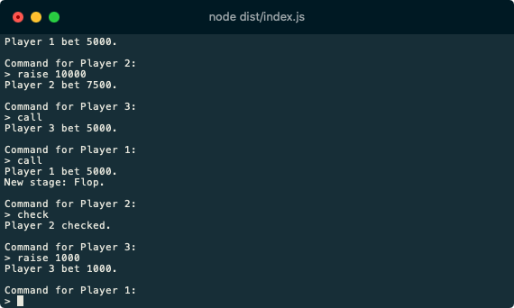

# HoldEm
HoldEm is a Texas Holdem engine written in TypeScript.

## Features
- [x] 52 card deck with different suits and shuffling
- [x] Table structure which can be used to create lobbies for multiplayer
- [x] Chip system
- [x] Basic Poker game progression
- [x] Checking, Calling, Betting and Raising 
- [x] Hand detection 
- [ ] Hand strength calculation
- [ ] Determination of winning hands
- [ ] All-ins and side pots

## Preview

